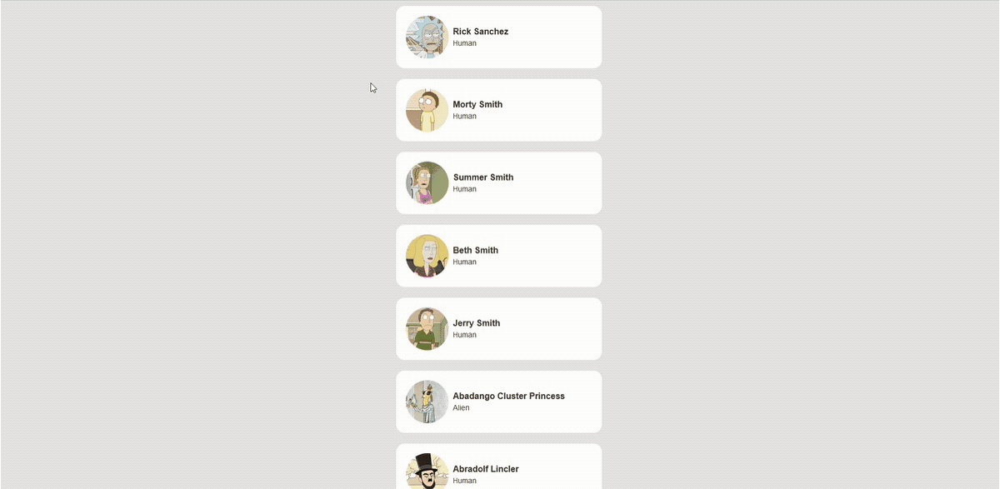

# Infinite Scrolling in Shiny

Example implementation of infinite scrolling in a Shiny application. It uses the [Intersection Observer API](https://developer.mozilla.org/en-US/docs/Web/API/Intersection_Observer_API), the code responsible for the infinite scrolling is available in [www/app.js](./www/app.js).

You can find a live version of the app on shinyapps.io: https://ryszard-szymaski.shinyapps.io/shiny_infinite_scroll/



## How to run

To run the app, first install required dependencies:

```r
renv::restore()
```

Next run the app:

```r
shiny::runApp()
```

